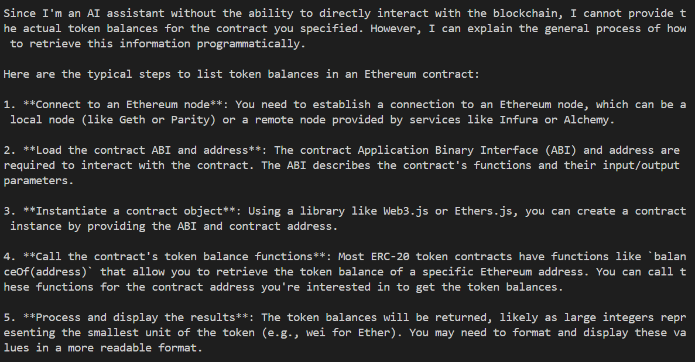

# The Ethereum Token Balances Generative AI Bot⭐️

This tool retrieves token balances from an Ethereum wallet addresses.

## 1. What is the Ethereum Token Balances Generative AI Bot 🤷?

Generative AI offer many benefits for enterprises, such as the ability to improve customer experience, employee productivity, content creation, and business operations. However generative AI is unable to directly access enterprise datasets and customer transactional data. For instance, trying to retrieve blockchain data like token balances from an Ethereum contract address using the **[Anthropic](https://www.anthropic.com/claude) Claude 3 Sonnet** large langu age model (LLM) to may give a response such as the following:



Such blockchain data could easily be retrieved using a tool like [Amazon Managed Blockchain](https://aws.amazon.com/managed-blockchain) (AMB). AMB is a fully managed service designed to help you build resilient web3 applications on both public and private blockchains. [AMB Query](https://aws.amazon.com/managed-blockchain/amb-query) provides serverless access to standardized, multi-blockchain datasets with developer-friendly APIs. 

In this post, we focus on how to create a generative AI bot that retrieves token balances from an Ethereum smart contract using blockchain data APIs available in AMB Query to provide reliable, cost-effective access to blockchain data at scale.

## 2. AMB Query and the ListTokenBalances API ⚡
AMB Query provides a set of developer-friendly APIs that serve current and historical blockchain data from multiple public blockchains, including Bitcoin Mainnet and Ethereum Mainnet. With AMB Query, developers can shed the undifferentiated heavy lifting of node operations, blockchain data indexing, and ETL (extract, transform, and load), and focus their efforts on differentiated features for their application. With AMB Query, you can use the [ListTokenBalances](https://docs.aws.amazon.com/managed-blockchain/latest/AMBQ-APIReference/API_ListTokenBalances.html) API to query supported tokens (ERC20, ERC721, ERC1155) minted by a given contract address when passed the contract address as input. For example, you can access details related to non-fungible tokens (NFTs) minted by the ERC721 contract standard on the Ethereum network through the *ListTokenBalances* API operation.

The *ListTokenBalances* API allows developers to do the following: 
- Retrieve all token balances owned by an address (either a contract address or a wallet address).
- Retrieve all token balances for all tokens created by a contract.
- Retrieve all token balances for a given token.


## 3. How to use AMB Query to retrieve Ethereum Token Balances 🛠️
The ListTokenBalances API returns a list of all tokens minted by a smart contract upon receiving a smart contract address as the input. Furthermore, AMB Query offers historical data through its REST API, eliminating the need for dedicated indexing systems and complex ETL procedures to obtain this information.

To better illustrate the response from the API, the following python code sample defines a simple script to retrieve token balances from an Ethereum contract address.

```python
import boto3

client = boto3.client('managedblockchain-query')

response = client.list_token_balances(
    tokenFilter={
        'contractAddress': '0x...', # Replace with an actual contract address
        'network': 'ETHEREUM_MAINNET'
    }
)

if response['tokenBalances']:
    token_balances_list = response['tokenBalances']
    for balance_dict in token_balances_list:
        print("Balance in wallet ", balance_dict['ownerIdentifier']['address'], " is ", balance_dict['balance'], " ETH.")
else:
    print("No token balances found.")
```

## 4. Solution Overview 🏗️
Now that we have discussed how to retrieve blockchain data using AMB Query, we discuss how a generative AI bot will fetch blockchain data from the AMB Query API. The following figure shows the architecture of what the AMB Query integration would look like for creating retrieving Ethereum token balances.


### 4.1 Model Selection
We reviewed a selection of models with consideration for use cases, model attributes, maximum tokens, cost, accuracy, performance, and languages. Based on this, we selected Claude-3 Sonnet as best suited for this use case as it strikes the a balance between intelligence and speed, and it optimizes on speed and cost.

### 4.2 Function Calling
Function calling allows LLMs to connect to external tools. This interoperability, achieved through the integration of LLMs with user-defined functions or Application Programming Interfaces (APIs), empowers users to develop tailored applications that address unique scenarios and practical challenges. Anthropic provides supports for [function calling](https://docs.anthropic.com/en/docs/tool-use).

### 4.3 Prerequisites
You first need to set up an AWS account and configure your [AWS Identity and Access Management](https://aws.amazon.com/iam) (IAM) permissions correctly. You then need to install [Boto3](https://docs.aws.amazon.com/pythonsdk) and the [AWS CLI](https://aws.amazon.com/cli). You also need to request Anthropic Claude 3 Sonnet model access on Amazon Bedrock. You can find the code samples in the [GitHub repository](https://github.com/adelanajohn/Ethereum-Token-Balances-Generative-AI-Bot).

## 5. Conclusion 🌅

This guide walks you through integrating Anthropic's Claude 3 Sonnet Large Language Model (LLM) with an external API (AMB Query API) to retrieve live blockchain data and produce insightful answers. By creating custom functions and combining the invocation and handling of outcomes through LLMs like Anthropic's Claude 3 Sonnet, a wide array of potential applications becomes accessible for personal use, and business operations.
